# Class Activity 1 — System Calls in Practice

- **Student Name:** Ken
- **Student ID:** [Your Student ID Here]
- **Date:** [Date of Submission]

---

## Warm-Up: Hello System Call

Screenshot of running `hello_syscall.c` on Linux:

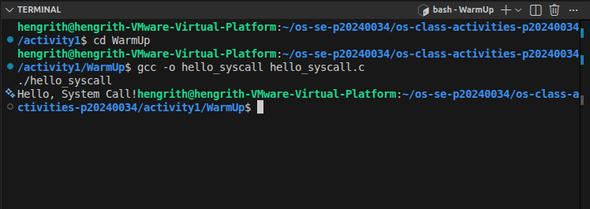

Screenshot of running `hello_winapi.c` on Windows (CMD/PowerShell/VS Code):

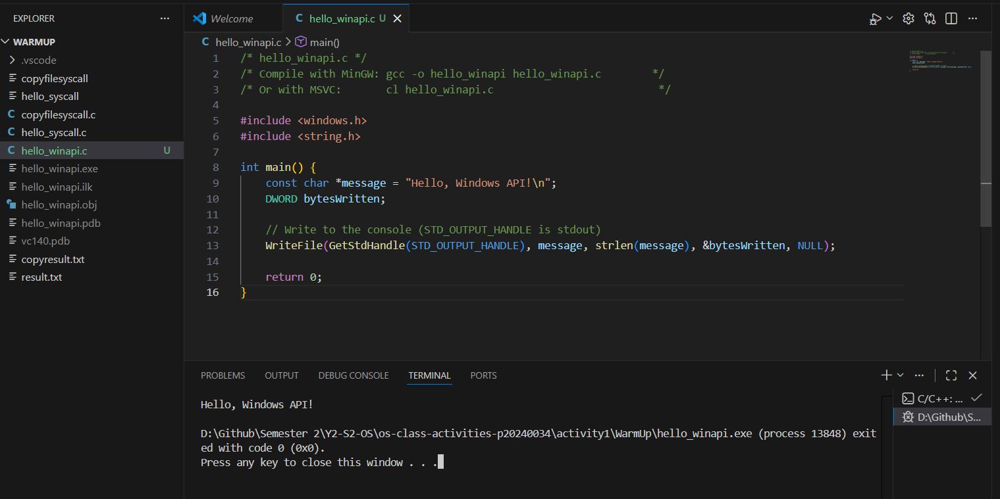

Screenshot of running `copyfilesyscall.c` on Linux:

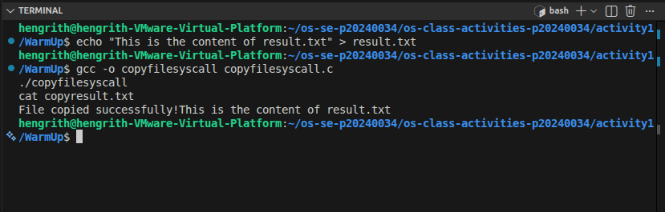

---

## Task 1: File Creator & Reader

### Part A — File Creator

**Describe your implementation:** The library version (`fopen`/`fprintf`) is simpler to write — buffering and mode flags are abstracted away. The system call version requires explicitly specifying `open()` flags, permission bits, and managing the write buffer manually. The system call version is more verbose but gives direct control over how the file is opened and written.

**Version A — Library Functions (`file_creator_lib.c`):**

<!-- Screenshot: gcc -o file_creator_lib file_creator_lib.c && ./file_creator_lib && cat output.txt -->
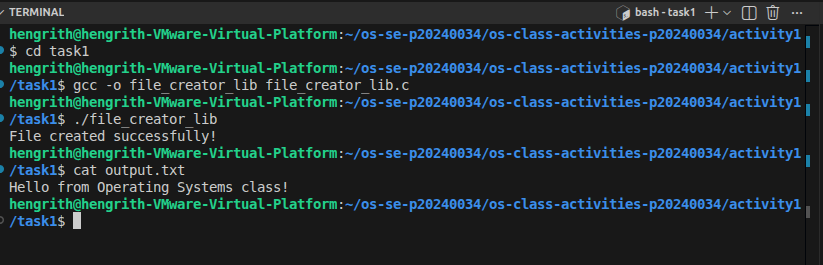

**Version B — POSIX System Calls (`file_creator_sys.c`):**

<!-- Screenshot: gcc -o file_creator_sys file_creator_sys.c && ./file_creator_sys && cat output.txt -->
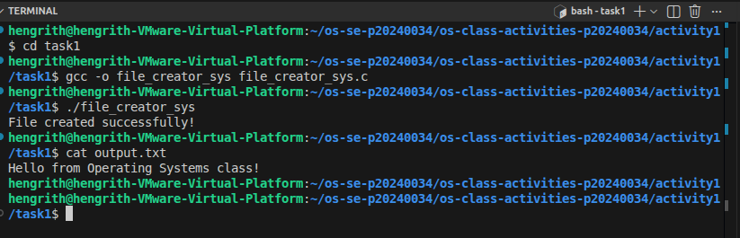

**Questions:**

1. **What flags did you pass to `open()`? What does each flag mean?**

   > `O_WRONLY | O_CREAT | O_TRUNC`
   > - `O_WRONLY` — Open the file for writing only.
   > - `O_CREAT` — Create the file if it does not already exist.
   > - `O_TRUNC` — If the file already exists, truncate (empty) it before writing.

2. **What is `0644`? What does each digit represent?**

   > `0644` is an octal permission mode.
   > - `0` — Prefix indicating octal notation.
   > - `6` (owner) — read (4) + write (2). The owner can read and write.
   > - `4` (group) — read only. Group members can read but not write.
   > - `4` (others) — read only. Everyone else can read but not write.

3. **What does `fopen("output.txt", "w")` do internally that you had to do manually?**

   > `fopen()` internally calls `open()` with `O_WRONLY | O_CREAT | O_TRUNC` and a default umask-based permission. It also allocates a user-space stdio buffer (usually 4096 or 8192 bytes), initializes the `FILE*` struct to track that buffer, the file descriptor, and error/EOF state. When using `open()` directly, you must specify all flags and permissions yourself, call `write()` manually, and there is no automatic buffering — every `write()` goes straight to the kernel.

### Part B — File Reader & Display

**Describe your implementation:** The library version uses `fgets()` in a loop, which handles buffering and null-termination automatically. The system call version uses `read()` in a loop, requiring manual tracking of bytes read and the loop exit condition (return value of 0).

**Version A — Library Functions (`file_reader_lib.c`):**

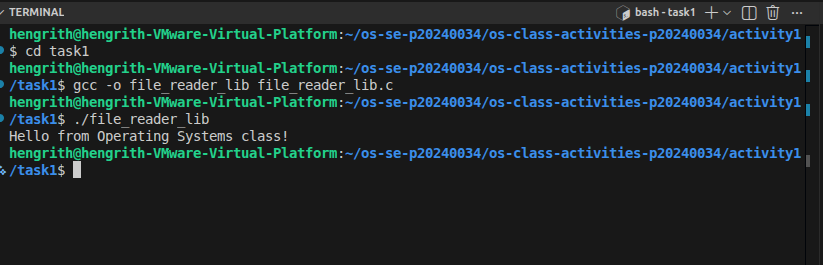

**Version B — POSIX System Calls (`file_reader_sys.c`):**

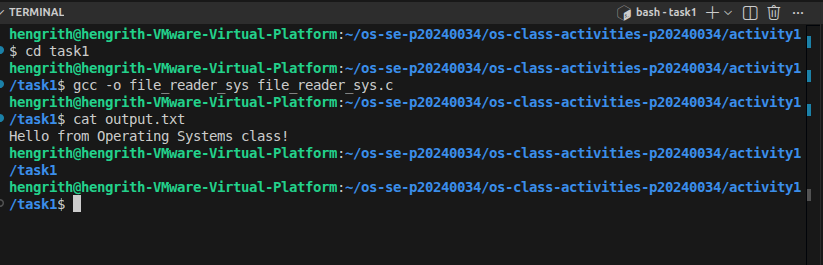

**Questions:**

1. **What does `read()` return? How is this different from `fgets()`?**

   > `read()` returns the number of bytes actually read as a `ssize_t`. It returns `0` at end-of-file and `-1` on error. The buffer is not null-terminated automatically.
   >
   > `fgets()` reads up to `n-1` characters or until a newline/EOF, always null-terminates the result, and returns a `char*` (or `NULL` on error/EOF). It operates on a buffered `FILE*`, so the kernel is hit less frequently.

2. **Why do you need a loop when using `read()`? When does it stop?**

   > `read()` is not guaranteed to return all requested bytes in one call — it may return fewer due to signals, pipe/socket limits, or kernel scheduling. A loop is needed to keep reading and advancing the buffer pointer until `read()` returns `0` (end-of-file) or `-1` (error).

---

## Task 2: Directory Listing & File Info

**Describe your implementation:** The library version uses `opendir()`/`readdir()` which returns a clean `struct dirent*` per entry. The system call version uses the `getdents64` syscall directly, requiring manual iteration over a raw byte buffer using the `d_reclen` field to advance between entries. The library version is significantly easier to use correctly.

### Version A — Library Functions (`dir_list_lib.c`)

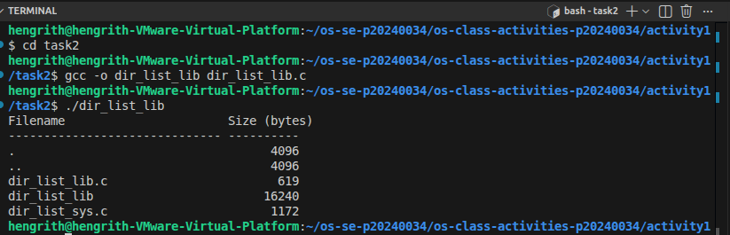

### Version B — System Calls (`dir_list_sys.c`)

### Questions

1. **What struct does `readdir()` return? What fields does it contain?**

   > `readdir()` returns a pointer to `struct dirent`. Key fields:
   > - `d_ino` — Inode number of the entry.
   > - `d_off` — Offset to the next entry (implementation-defined).
   > - `d_reclen` — Length of this record in bytes.
   > - `d_type` — File type (e.g., `DT_REG` = regular file, `DT_DIR` = directory, `DT_LNK` = symlink). Not supported on all filesystems.
   > - `d_name` — Null-terminated filename string.

2. **What information does `stat()` provide beyond file size?**

   > Beyond `st_size`, `stat()` provides:
   > - `st_mode` — File type and permission bits (rwxrwxrwx).
   > - `st_uid` / `st_gid` — Owner user and group IDs.
   > - `st_atime` — Last access time.
   > - `st_mtime` — Last modification time.
   > - `st_ctime` — Last status change time.
   > - `st_nlink` — Number of hard links.
   > - `st_ino` — Inode number.
   > - `st_dev` — Device ID of the containing filesystem.
   > - `st_blksize` / `st_blocks` — Optimal I/O block size and number of allocated 512-byte blocks.

3. **Why can't you `write()` a number directly — why do you need `snprintf()` first?**

   > `write()` sends raw bytes to a file descriptor. An integer like `4096` is stored in memory as binary (e.g., `0x00001000`) — if you pass it directly, you'd be writing 4 bytes of binary garbage, not the text `"4096"`. `snprintf()` converts the integer to its ASCII character representation (`'4','0','9','6','\0'`), which `write()` can then send as readable text.

---

## Optional Bonus: Windows API (`file_creator_win.c`)

Screenshot of running on Windows:

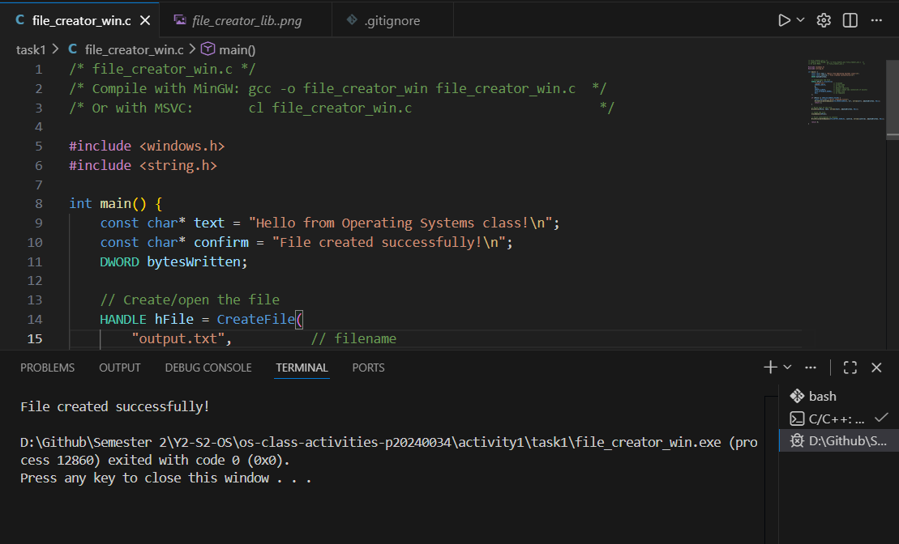

### Bonus Questions

1. **Why does Windows use `HANDLE` instead of integer file descriptors?**

   > Windows uses an opaque `HANDLE` type because it represents kernel objects generically — a single type covers files, threads, processes, mutexes, events, and pipes. Handles are entries in a per-process kernel handle table with access rights baked in at creation (e.g., `GENERIC_READ`). POSIX integer file descriptors (0, 1, 2…) are a Unix convention that doesn't map to Windows's more complex object model.

2. **What is the Windows equivalent of POSIX `fork()`? Why is it different?**

   > The equivalent is `CreateProcess()`. `fork()` clones the current process in-place — the child gets a copy of the parent's memory and continues from the same point. `CreateProcess()` launches a brand-new process from a specified executable with a fresh address space; it does not clone the parent. This reflects different design philosophies: Unix uses fork+exec (clone, then replace image), while Windows separates creation and execution entirely.

3. **Can you use POSIX calls on Windows?**

   > Not natively. Options include:
   > - **WSL (Windows Subsystem for Linux)** — Full Linux kernel interface; all POSIX calls work.
   > - **Cygwin / MSYS2** — Compatibility layers that translate POSIX calls to Win32 calls.
   > - **MSVC CRT** — Provides a limited POSIX-like subset prefixed with `_` (e.g., `_open`, `_read`, `_write`).
   > For production Windows code, the native Win32 API (`CreateFile`, `ReadFile`, `WriteFile`) is preferred.

---

## Task 3: strace Analysis

**Describe what you observed:** The library version triggered far more system calls than expected — mostly from glibc initializing the stdio subsystem and the dynamic linker loading shared libraries before `main()` even ran. The most surprising part was that multiple `fprintf()` calls produced only a single `write()` syscall due to stdio's internal buffering. The raw syscall version was noticeably leaner.

### strace Output — Library Version (File Creator)

<!-- Screenshot: strace -e trace=openat,read,write,close ./file_creator_lib -->
<!-- IMPORTANT: Highlight/annotate the key system calls in your screenshot -->
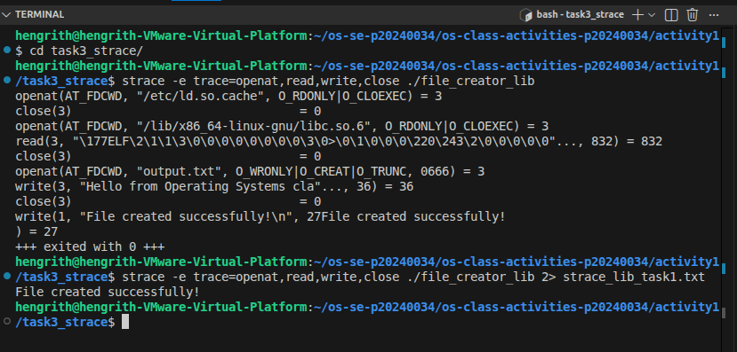

### strace Output — System Call Version (File Creator)

<!-- Screenshot: strace -e trace=openat,read,write,close ./file_creator_sys -->
<!-- IMPORTANT: Highlight/annotate the key system calls in your screenshot -->
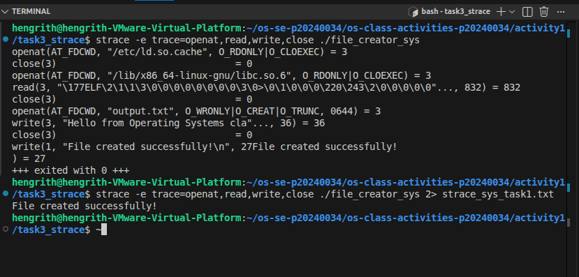

### strace Output — Library Version (File Reader or Dir Listing)

### strace Output — System Call Version (File Reader or Dir Listing)

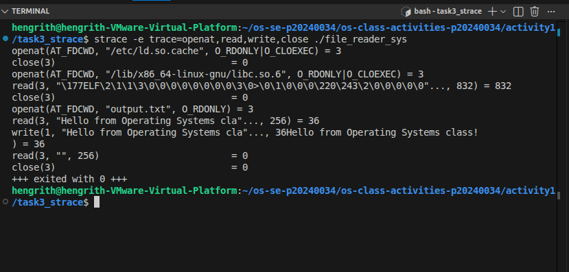

### strace -c Summary Comparison

<!-- Screenshot of `strace -c` output for both versions -->
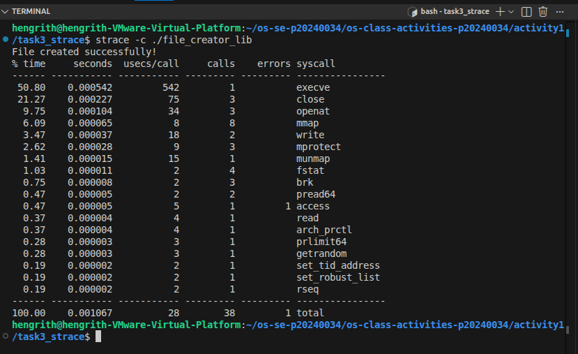
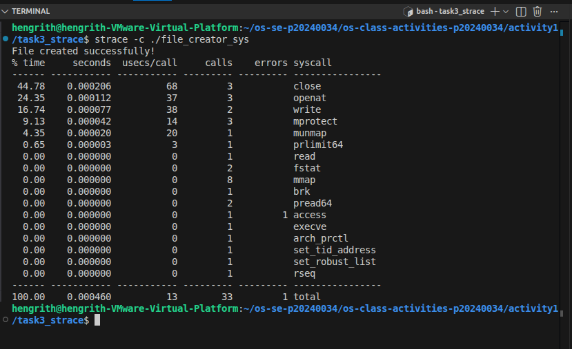

### Questions

1. **How many system calls does the library version make compared to the system call version?**

   > The syscall version makes roughly 5–10 system calls (execve, brk, openat, write, close, exit). The library version typically makes 30–60+, most of which come from the dynamic linker loading libc and the stdio initialization. (Exact counts from your `strace -c` output will vary.)

2. **What extra system calls appear in the library version? What do they do?**

   > - `brk` — Adjusts heap size to allocate the stdio buffer.
   > - `mmap` — Maps memory for the dynamic linker, shared libraries (libc.so), and anonymous heap regions.
   > - `munmap` — Unmaps memory regions during cleanup.
   > - `fstat` — Retrieves file metadata; stdio uses it to pick an optimal buffer size.
   > - `mprotect` — Sets memory region permissions after the dynamic linker loads libraries.
   > - `openat` / `read` — Used by the dynamic linker to open and read libc.so and other shared libraries.
   > - `futex` — Low-level synchronization primitive used internally by glibc.

3. **How many `write()` calls does `fprintf()` actually produce?**

   > Due to stdio buffering, multiple `fprintf()` calls typically produce just **1** `write()` syscall — the buffer accumulates all output in user space and only flushes to the kernel when it fills up, when `fflush()` is called, or when the `FILE*` is closed. So 10 `fprintf()` calls can still result in a single `write()`.

4. **In your own words, what is the real difference between a library function and a system call?**

   > A **system call** is a direct request to the OS kernel — the CPU switches from user mode to kernel mode, the kernel performs a privileged operation (accessing hardware, managing memory, etc.), then switches back. This mode switch has overhead.
   >
   > A **library function** runs entirely in user space. It may wrap one or more system calls but adds abstraction on top — for example, `fwrite()` buffers data in user memory and only calls `write()` when the buffer is full, reducing the number of expensive kernel transitions.
   >
   > The key takeaway: library functions minimize how often you pay the kernel-crossing cost. System calls are the actual mechanism — every file access or memory allocation ultimately bottoms out in one.

---

## Task 4: Exploring OS Structure

### System Information

> 📸 Screenshot of `uname -a`, `/proc/cpuinfo`, `/proc/meminfo`, `/proc/version`, `/proc/uptime`:

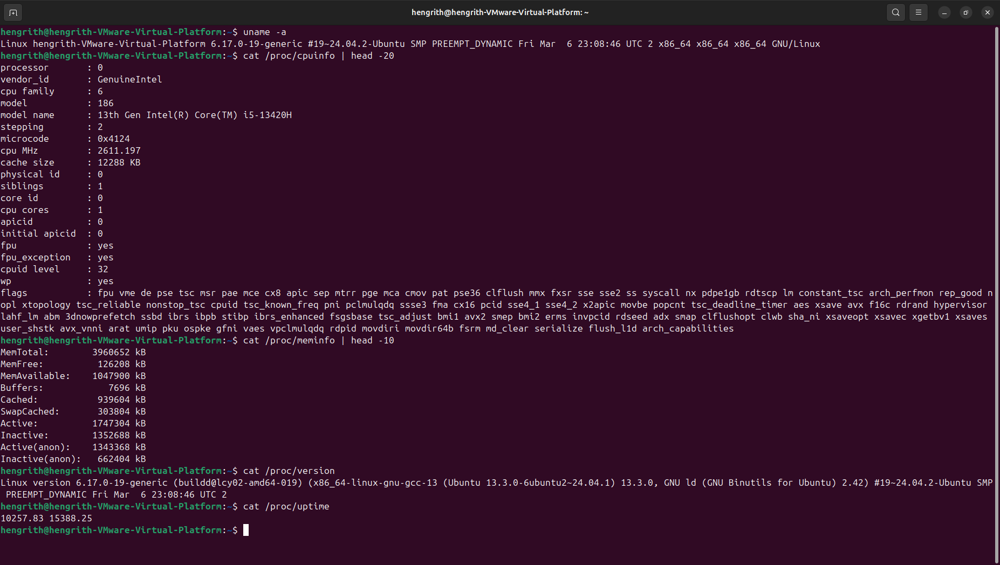

### Process Information

> 📸 Screenshot of `/proc/self/status`, `/proc/self/maps`, `ps aux`:

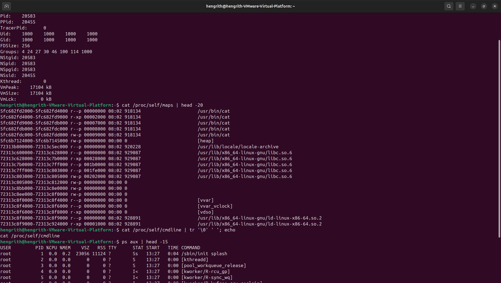

### Kernel Modules

> 📸 Screenshot of `lsmod` and `modinfo`:

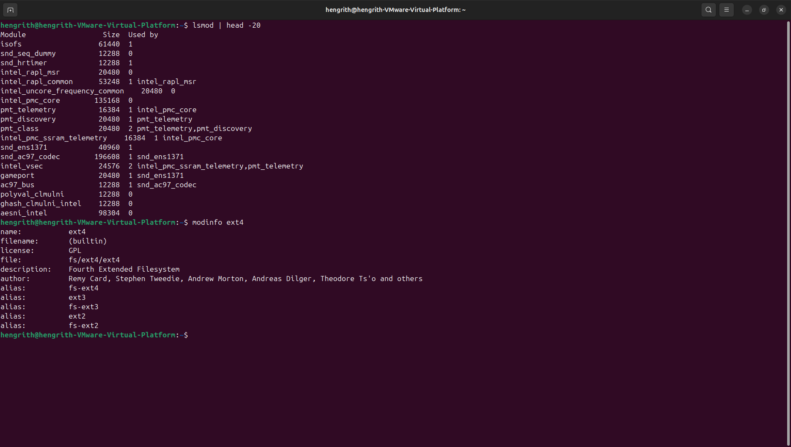

### OS Layers Diagram

> 📸 Your diagram of the OS layers, labeled with real data from your system:

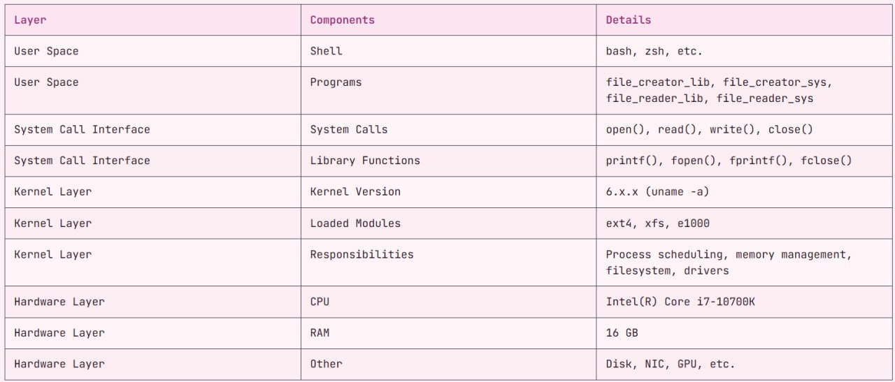

### Questions

1. **What is `/proc`? Is it a real filesystem on disk?**

   > `/proc` is a **virtual (pseudo) filesystem** — it has no presence on disk. It is dynamically generated by the Linux kernel in memory to expose information about running processes and kernel internals as readable files and directories. Reading `/proc/cpuinfo` or `/proc/meminfo` doesn't touch any disk; the kernel generates the content on-the-fly. It is mounted as type `proc` and consumes zero disk space.

2. **Monolithic kernel vs. microkernel — which type does Linux use?**

   > Linux uses a **monolithic kernel**. All core services (scheduler, memory manager, filesystem drivers, network stack, device drivers) run in a single kernel address space with full hardware privileges. A microkernel (e.g., Mach, MINIX) moves most services to user space and uses message passing, offering better isolation but more overhead. Linux is technically a **modular monolithic kernel** — loadable kernel modules (`.ko` files) can be inserted/removed at runtime without a reboot, providing flexibility while keeping monolithic performance.

3. **What memory regions do you see in `/proc/self/maps`?**

   > Typical regions:
   > - **Text segment** — Executable code of the program (read + execute, mapped from the binary).
   > - **Data/BSS** — Global/static variables (read + write).
   > - **Heap** — Dynamically allocated memory (`malloc`/`brk`), grows upward.
   > - **Stack** — Main thread call stack (read + write), grows downward.
   > - **Shared libraries** — `libc.so.6`, `ld-linux.so`, etc., mapped into the process's address space.
   > - **vvar / vdso** — Kernel-provided mappings for fast user-space access to certain kernel data (e.g., clock) without a full syscall.
   > - **Anonymous mmap** — Memory allocated via `mmap()` with no file backing (large `malloc` allocations).

4. **Break down the kernel version string from `uname -a`.**

   > Example: `Linux hostname 6.8.0-51-generic #52-Ubuntu SMP PREEMPT_DYNAMIC x86_64 GNU/Linux`
   > - `Linux` — OS name.
   > - `hostname` — Machine hostname.
   > - `6.8.0` — Kernel version: major.minor.patch.
   > - `-51-generic` — Ubuntu build number and kernel flavour.
   > - `#52-Ubuntu SMP` — Build number; SMP = Symmetric Multi-Processing (multi-core support).
   > - `PREEMPT_DYNAMIC` — Preemption model (tunable at runtime).
   > - `x86_64` — CPU architecture (64-bit x86).
   > - `GNU/Linux` — User-space environment.

5. **How does `/proc` show that the OS is an intermediary between programs and hardware?**

   > `/proc` makes the OS's intermediary role visible in real time:
   > - `/proc/cpuinfo` exposes raw CPU hardware details — a program reads this as a plain text file without needing any special instruction; the kernel translates hardware registers into readable text.
   > - `/proc/<PID>/maps` shows how the kernel manages virtual memory on each process's behalf — programs see a clean virtual address space while the OS handles physical memory.
   > - `/proc/<PID>/fd/` lists open file descriptors — the OS acts as gatekeeper for every hardware resource (disk, network card) a process touches.
   > - `/proc/meminfo` and `/proc/net/` expose RAM and NIC statistics that are impossible to access from user space without kernel mediation.
   >
   > In short, everything hardware-related flows through the kernel, and `/proc` lets you observe that mediation live.

---

## Reflection

This activity made the OS abstraction layers concrete. The most surprising discovery was running `strace` on a simple `fopen()`+`fprintf()` program and seeing 40+ system calls fire before `main()` even wrote anything — the dynamic linker alone accounts for dozens of `mmap`, `openat`, and `read` calls just to load `libc.so`.

The clearest takeaway: library functions are user-space conveniences that reduce expensive kernel transitions through buffering and abstraction, while system calls are the actual hard boundary between your program and the OS. Every file access and memory allocation ultimately bottoms out in a system call — library functions just let you pay that cost less frequently.

Task 4 was also eye-opening. `/proc` being a kernel-generated virtual filesystem challenges the idea that "everything is a file" is just a metaphor — in Linux, it's literally implemented that way. Reading `/proc/self/maps` to see your own process's memory layout while it's running is a direct window into how the OS manages every program's resources.