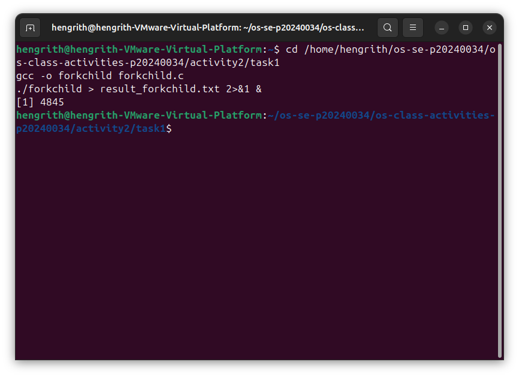
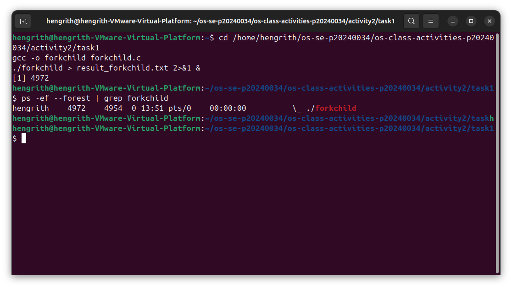
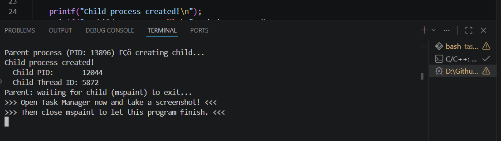
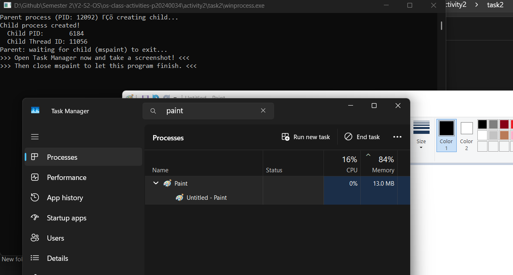
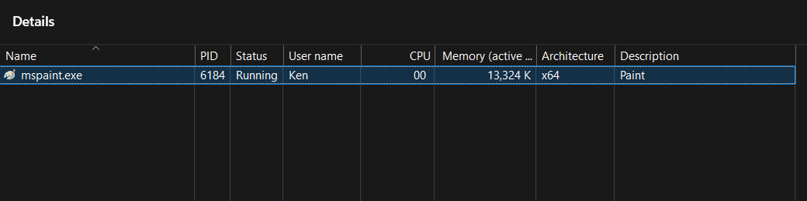
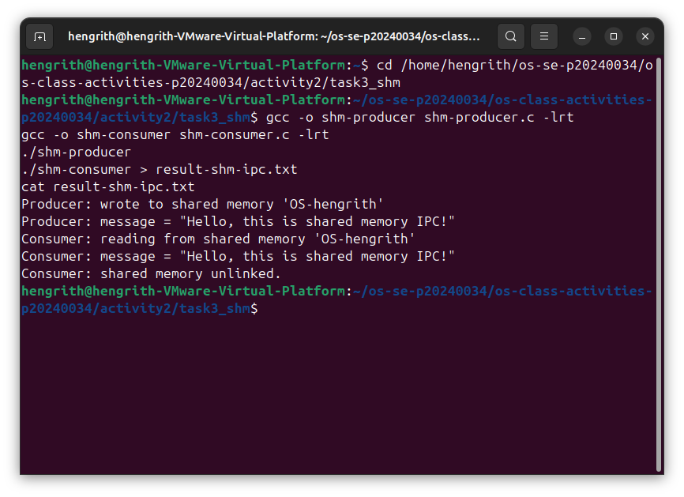
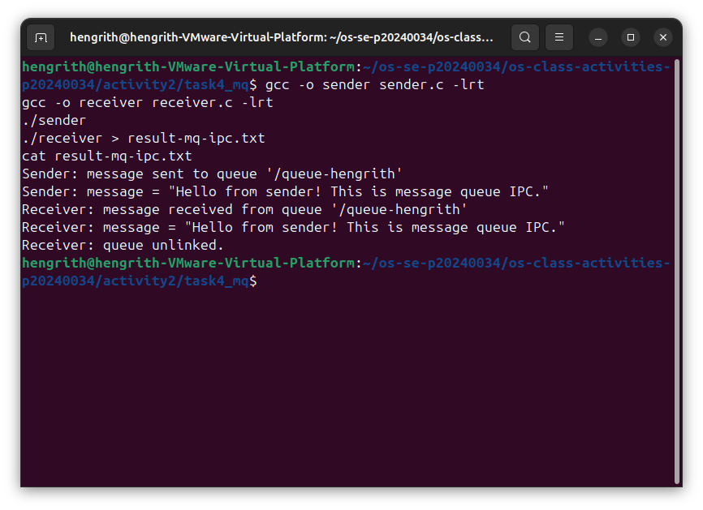

# Class Activity 2 — Processes & Inter-Process Communication

- **Student Name:** Hengrith
- **Student ID:** p20240034
- **Date:** 2026-03-31

---

## Task 1: Process Creation on Linux (fork + exec)

### Compilation & Execution

Screenshot of compiling and running `forkchild.c`:



### Process Tree

Screenshot of the parent-child process tree (using `ps --forest`, `pstree`, or `htop` tree view):



### Output
```
[Paste the content of result_forkchild.txt here]
```

### Questions

1. **What does `fork()` return to the parent? What does it return to the child?**

   > `fork()` returns the child's PID to the parent, and returns 0 to the child. On error it returns -1.

2. **What happens if you remove the `waitpid()` call? Why might the output look different?**

   > The parent process exits immediately without waiting for the child, potentially leaving the child as a zombie process. The output order becomes unpredictable since parent and child run concurrently.

3. **What does `execlp()` do? Why don't we see "execlp failed" when it succeeds?**

   > `execlp()` replaces the current process image with a new program (here `ls -la`). On success, the original code is completely overwritten, so the line after `execlp()` is never reached.

4. **Draw the process tree for your program (parent → child). Include PIDs from your output.**

   > ```
   > forkchild (Parent PID: XXXX)
   > └── forkchild (Child PID: YYYY) → exec → ls -la
   > ```
   > *(Replace XXXX and YYYY with the actual PIDs from your result_forkchild.txt)*

5. **Which command did you use to view the process tree (`ps --forest`, `pstree`, or `htop`)? What information does each column show?**

   > Used `ps -ef --forest | grep forkchild`. Columns: UID (user), PID (process ID), PPID (parent PID), C (CPU usage), STIME (start time), TTY (terminal), TIME (CPU time), CMD (command name, indented to show hierarchy).

---

## Task 2: Process Creation on Windows

### Compilation & Execution

Screenshot of compiling and running `winprocess.c`:



### Task Manager Screenshots

Screenshot showing process tree in the **Processes** tab (mspaint nested under your program):



Screenshot showing PID and Parent PID in the **Details** tab:



### Questions

1. **What is the key difference between how Linux creates a process (`fork` + `exec`) and how Windows does it (`CreateProcess`)?**

   > Linux uses two steps: `fork()` clones the parent, then `exec()` replaces it with a new program. Windows uses a single `CreateProcess()` call that creates and loads the new process in one step — there is no fork/clone stage.

2. **What does `WaitForSingleObject()` do? What is its Linux equivalent?**

   > It blocks the parent until the specified process handle signals (i.e., the child exits). The Linux equivalent is `waitpid()`.

3. **Why do we need to call `CloseHandle()` at the end? What happens if we don't?**

   > Handles are kernel resources. Not closing them causes a handle leak — the OS keeps the process/thread objects alive in memory even after they exit, wasting resources until the parent process itself terminates.

4. **In Task Manager, what was the PID of your parent program and the PID of mspaint? Do they match your program's output?**

   > PID 6184 for ms paint.
5. **Compare the Processes tab (tree view) and the Details tab (PID/PPID columns). Which view makes it easier to understand the parent-child relationship? Why?**

   > The Processes tab tree view is easier — it visually nests child processes under their parent so the relationship is immediately obvious. The Details tab requires manually matching PID and PPID numbers across rows.

---

## Task 3: Shared Memory IPC

### Compilation & Execution

Screenshot of compiling and running `shm-producer` and `shm-consumer`:



### Output
```
[Paste the content of result-shm-ipc.txt here]
```

### Questions

1. **What does `shm_open()` do? How is it different from `open()`?**

   > `shm_open()` creates or opens a POSIX shared memory object identified by a name. Unlike `open()` which works with files on disk, `shm_open()` creates an object in memory (under `/dev/shm`) that multiple processes can map and share directly.

2. **What does `mmap()` do? Why is shared memory faster than other IPC methods?**

   > `mmap()` maps the shared memory object into the process's virtual address space, so the process can read/write it like a regular pointer. It is faster than pipes or message queues because data is never copied — both processes access the same physical memory directly with no kernel involvement per read/write.

3. **Why must the shared memory name match between producer and consumer?**

   > The name is how the OS identifies the shared memory object. If the names differ, the consumer opens a different (or nonexistent) object and cannot see the data the producer wrote.

4. **What does `shm_unlink()` do? What would happen if the consumer didn't call it?**

   > `shm_unlink()` removes the shared memory object from the system. If it is never called, the object persists in `/dev/shm` after both processes exit, wasting memory until the system reboots or it is manually removed.

5. **If the consumer runs before the producer, what happens? Try it and describe the error.**

   > `shm_open()` in the consumer fails with `No such file or directory` because the shared memory object does not exist yet. The program prints the error and the hint "Did you run shm-producer first?" then exits.

---

## Task 4: Message Queue IPC

### Compilation & Execution

Screenshot of compiling and running `sender` and `receiver`:



### Output
```
[Paste the content of result-mq-ipc.txt here]
```

### Questions

1. **How is a message queue different from shared memory? When would you use one over the other?**

   > Shared memory is a raw region both processes map directly — fast but requires manual synchronization. A message queue is OS-managed and delivers discrete, ordered messages with built-in synchronization. Use shared memory for high-speed bulk data transfer; use message queues when you need structured, ordered, independent messages between processes.

2. **Why does the queue name in `common.h` need to start with `/`?**

   > POSIX requires message queue names to start with `/` so the OS can identify them in the mqueue filesystem namespace. Names without `/` are rejected by `mq_open()`.

3. **What does `mq_unlink()` do? What happens if neither the sender nor receiver calls it?**

   > `mq_unlink()` removes the message queue from the system. If never called, the queue persists after both processes exit and continues to occupy kernel resources until reboot or manual removal with `mq_unlink()`.

4. **What happens if you run the receiver before the sender?**

   > `mq_open()` in the receiver fails with `No such file or directory` because the queue has not been created yet. The program prints the error and hint then exits.

5. **Can multiple senders send to the same queue? Can multiple receivers read from the same queue?**

   > Yes to both. Multiple senders can all write to the same queue concurrently. Multiple receivers can also read from the same queue, but each message is delivered to only one receiver — they compete for messages.

---

## Reflection

What did you learn from this activity? What was the most interesting difference between Linux and Windows process creation? Which IPC method do you prefer and why?

> This activity gave hands-on experience with how operating systems create and manage processes and how processes communicate. The most interesting difference was that Linux separates process creation into two steps (`fork` + `exec`), while Windows combines them into one (`CreateProcess`). The Linux approach is more flexible since the child can modify itself before exec, but Windows is more straightforward. I prefer shared memory for IPC because it is the fastest method — once both processes map the region, communication is as fast as a regular memory access with no kernel overhead per operation.